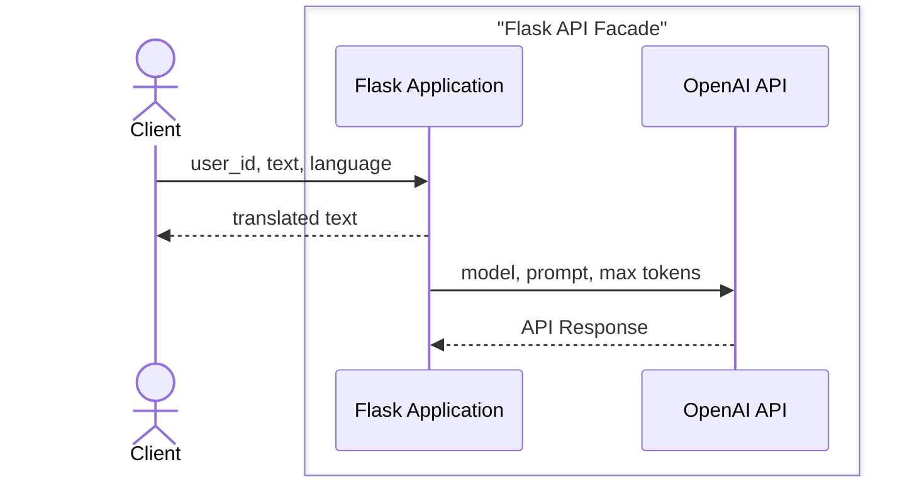




# 🚀 Boilerplate For Flask for Visual Studio

This is slightly imporved version of code from MSFT Flask tutorial. This is just a facade over chat gpt. 

## 📋 Table of Contents

- [Features](#features)
- [Diagrams](#diagrams)
- [Installation](#installation)
- [Open Questions](#questions)
- [Contributing](#contributing)
- [License](#license)

## ✨ Features

- 🛠️ ** Simple integration with openai
- Readme.md boiler plate for my public projects
- Allows prompt injection, so it is fun to mess with. 

## Diagrams



## 🛠️ Installation

You can run this using Visual Studio using included sln. 

To get started with this project, clone the repository and install the dependencies:

```bash
git clone https://github.com/your-username/your-repo-name.git
cd your-repo-name
pip install -r requirements.txt
```

Then you can run app using your favorite webserver.


## ❓ Questions 
- Why does visual studo use python 3.12? It's old and it gives a warning about it itself. 
- Why there is no even basic refactoring working? Is my setup, or jusat the way things are?

## 🛠️ Contributing

I doubt that there is any point in that 😀. 


## 📄 License

This project is licensed under the MIT License. If you have any questions or feedback, feel free to reach out. 😊